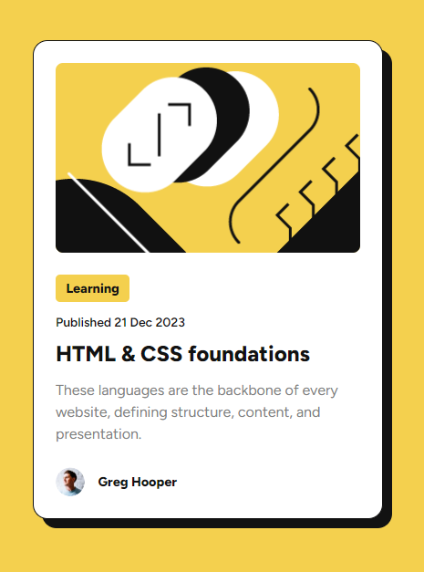

# Frontend Mentor - Blog preview card

This is a solution to the [Blog preview card challenge on Frontend Mentor](https://www.frontendmentor.io/challenges/blog-preview-card-ckPaj01IcS). Frontend Mentor challenges help you improve your coding skills by building realistic projects.

## Table of contents

- [Overview](#overview)
  - [The challenge](#the-challenge)
  - [Screenshot](#screenshot)
  - [Links](#links)
- [My process](#my-process)
  - [Built with](#built-with)
- [Author](#author)

## Overview

### The challenge

Users should be able to:

- See hover and focus states for all interactive elements on the page

### Screenshot

### Links

- Solution URL: [Github URL](https://github.com/devatorres/frontend-mentor-age-calculator-app)
- Live Site URL: [Live URL](https://gorgeous-starburst-788b67.netlify.app/)

## My process

### Built with

- Prettier
- JSX
- Clean Code
- Flexbox
- Responsive
- [React](https://reactjs.org/) - JS library
- Vite
- AtroposJs

### What I learned

Using AtroposJs.

## Author

- Instagram - [@atorres.dev](https://www.instagram.com/atorres.dev)
- Frontend Mentor - [@devatorres](https://www.frontendmentor.io/profile/devatorres)
- Github - [@devatorres](https://github.com/devatorres)
- Codepen - [@devatorres](https://codepen.io/devatorres)
- LinkedIn - [@devatorres](https://www.linkedin.com/in/devatorres)
